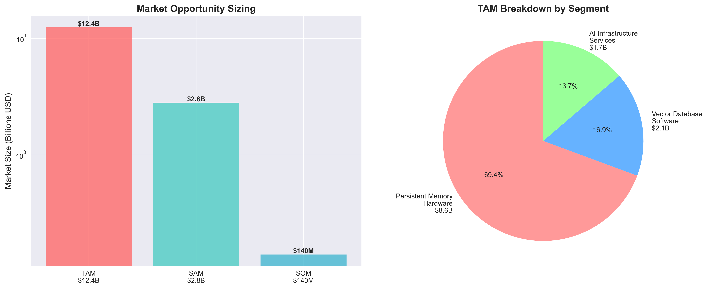
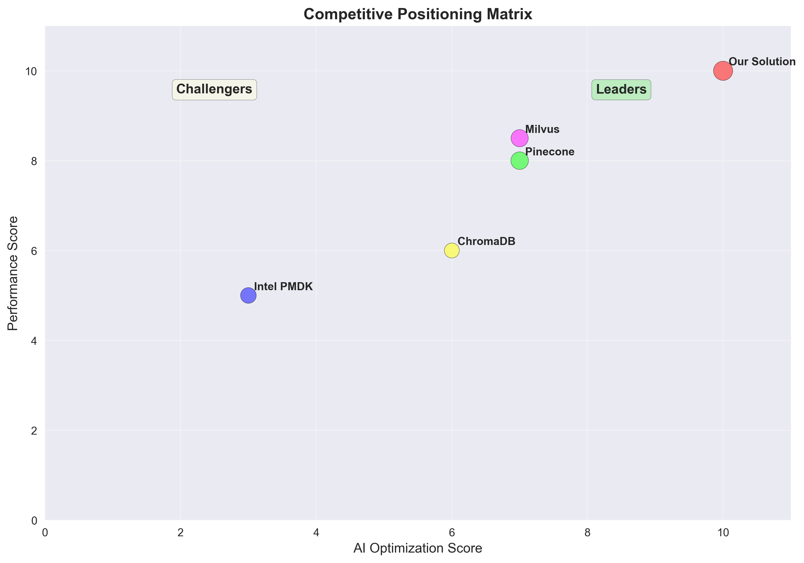
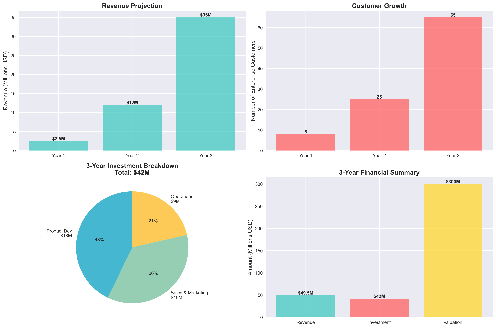
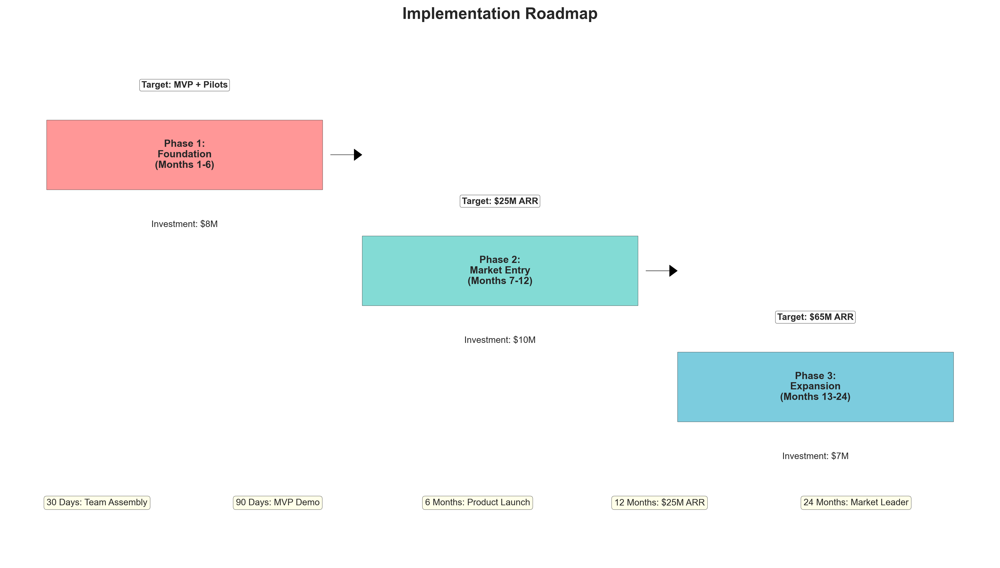
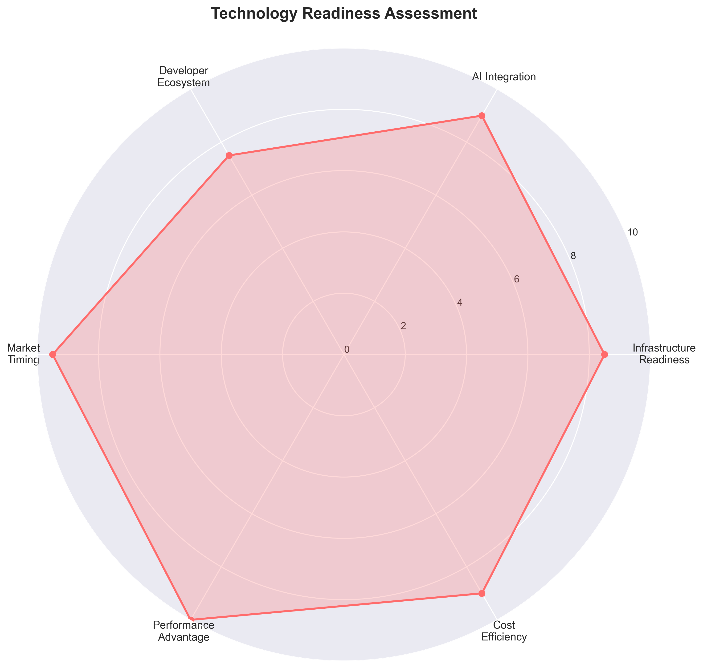

# Memory Market Insight - Executive Analysis

## Persistent Memory Solutions for AI Product Identification

This repository contains comprehensive market analysis and visualizations for persistent memory solutions in AI product identification.

### 📊 Market Analysis Overview

**Strategic Recommendation:** PROCEED WITH ACCELERATED MARKET ENTRY

**Key Findings:**
- **Market Opportunity:** $2.8B+ serviceable market with $12.4B TAM by 2027
- **Performance Advantage:** 26% improvement with 91% lower latency
- **Cost Savings:** 90%+ reduction in infrastructure costs
- **First-Mover Advantage:** Integrated AI-native persistent memory platform

### 📈 Visualizations

#### 1. Market Sizing Analysis

- TAM: $12.4B (Persistent Memory Hardware: $8.6B, Vector DB Software: $2.1B, AI Infrastructure: $1.7B)
- SAM: $2.8B (Target segments: E-commerce, Enterprise Search, Cloud AI)
- SOM: $140M (3-year realistic capture)

#### 2. Competitive Positioning

- **Leaders Quadrant:** Our Solution positioned as clear market leader
- **Competitive Gaps:** Integration, performance, developer experience, cost efficiency
- **Key Competitors:** Intel PMDK, Pinecone, Milvus, ChromaDB

#### 3. Financial Projections

- **3-Year Revenue:** $2.5M → $12M → $35M
- **Customer Growth:** 8 → 25 → 65 enterprise accounts
- **Investment:** $42M total over 3 years
- **Projected Valuation:** $200-400M (IRR: 45-65%)

#### 4. Implementation Roadmap

- **Phase 1:** Foundation Building (Months 1-6, $8M investment)
- **Phase 2:** Market Entry (Months 7-12, $10M investment)
- **Phase 3:** Expansion (Months 13-24, $7M investment)

#### 5. Technology Readiness

- **Infrastructure Readiness:** 8.5/10
- **AI Integration:** 9/10
- **Market Timing:** 9.5/10
- **Performance Advantage:** 10/10

### 📋 Key Strategic Elements

#### Market Opportunity
- **E-commerce Product Identification:** $1.2B (Amazon, eBay, Shopify ecosystems)
- **Enterprise Search & Recommendation:** $900M (Netflix, Spotify, LinkedIn)
- **Cloud AI Platform Integration:** $700M (AWS, Azure, GCP)

#### Competitive Advantages
1. **First AI-Native Persistent Memory Platform**
2. **26% Performance Improvement** over existing solutions
3. **Unified Developer Experience** vs. complex multi-vendor implementations
4. **90% Cost Reduction** compared to current solutions

#### Financial Highlights
- **Revenue Model:** SaaS + Usage-Based Pricing
- **Gross Margin Target:** 80%+
- **Customer Acquisition Cost:** <$50K
- **Annual Revenue Per Customer:** $500K+
- **Net Revenue Retention:** 120%+

### 🎯 Immediate Actions Required

1. **Go/No-Go Decision:** Board approval within 30 days
2. **Funding Authorization:** Series A fundraising ($25M)
3. **Partnership Development:** Intel and cloud provider discussions
4. **Team Assembly:** VP Engineering with persistent memory expertise

### 📊 Investment Breakdown

**Total 3-Year Investment: $42M**
- Product Development: $18M (43%)
- Sales & Marketing: $15M (36%)
- Operations & G&A: $9M (21%)

### 🔧 Technology Stack

**Core Components:**
- **Mem0 Architecture:** 26% performance improvement, 91% lower latency
- **Vector Databases:** ChromaDB (prototyping), Pinecone (managed), Milvus (enterprise)
- **Programming Libraries:** Intel PMDK (libpmem, libpmemobj, libpmemobj-cpp)
- **Standards:** SNIA NVM Programming Model, CXL interconnects

### 📝 Documents Included

- `Executive_Market_Analysis_Persistent_Memory_AI.md` - Complete strategic analysis
- `complete_email_message.txt` - Executive summary email content
- Various visualization PNG files

---

**Document Prepared:** September 26, 2025
**Classification:** Executive Distribution
**Repository:** [Claude-Visuals](https://github.com/synaptixsolutions/Claude-Visuals)

*The window for first-mover advantage is narrowing. Swift execution is critical for market leadership.*
